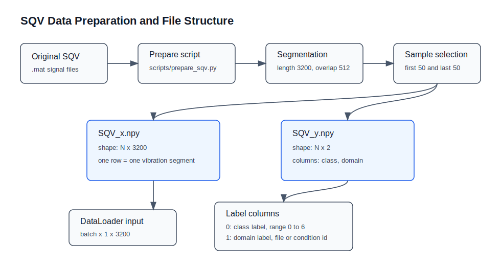

# Minimal DIS Training

This repository contains a minimal PyTorch implementation for DIS training on SQV and CWRU style vibration datasets.

## Run

```bash
pip install -r requirements.txt
python train.py --dataset SQV
```

For CWRU:

```bash
python train.py --dataset CWRU --data_dir ./data/CWRU/
```

## Data Format

Data files are not included in the repository.



Prepare SQV files from the original `.mat` files:

```bash
python scripts/prepare_sqv.py --mat_dir /path/to/SQV-public/mat_file --output_dir ./data/SQV/
```

Expected SQV files:

```text
data/SQV/SQV_x.npy
data/SQV/SQV_y.npy
```

Expected CWRU files:

```text
data/CWRU/CWRU_x.npy
data/CWRU/CWRU_y.npy
```

The label array should contain at least three columns:

```text
class_label, domain_label, position_label
```
